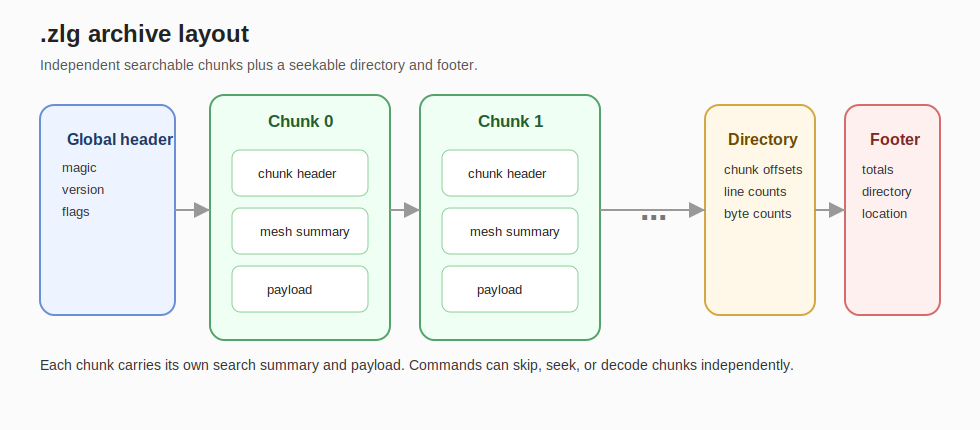
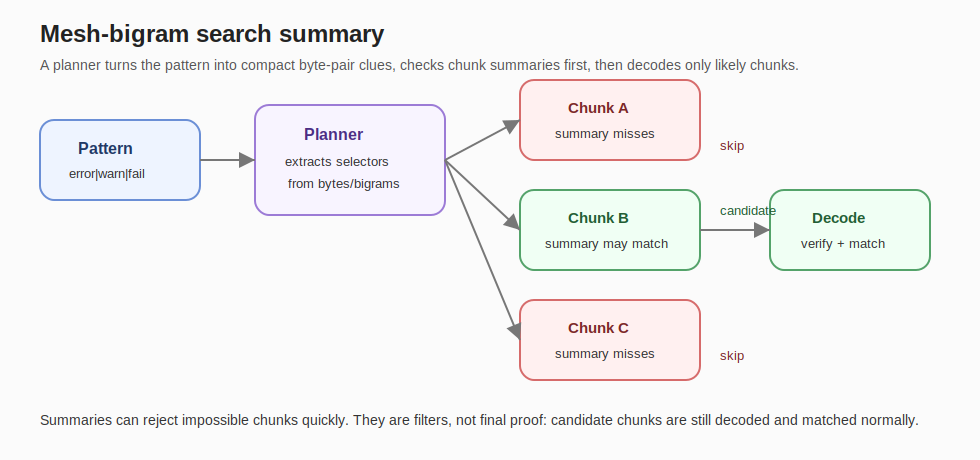

# zlg

`zlg` (pronounced "z-log") is a Linux command-line tool for searchable compressed log archives. It stores plaintext logs in `.zlg` files using independent chunks, zstd-backed payloads, per-chunk search summaries, and a seekable footer directory.

The name comes from "zstd log" / "z-log". The command is `zlg`; the archive extension is `.zlg`.

## Why zlg?

Compressed logs are small, but searching them usually means streaming the whole compressed file through `zgrep` or `gzip -dc | grep`. zlg keeps the storage benefit of compression while adding enough structure to skip irrelevant chunks, seek efficiently for `tail`, and report archive stats without a full decode.

In current smoke benchmarks, zlg shows three practical advantages:

- Smaller archives than gzip on the tested log corpora.
- Much faster compressed search than zgrep.
- Fast `head` and `tail` on compressed archives because zlg can use chunk metadata instead of streaming a whole gzip file.

## Quick examples

Compress a log:

```bash
zlg compress -m fast app.log app.log.zlg
zlg compress --mode standard app.log app.log.zlg
```

Search an archive with the default regex engine:

```bash
zlg grep -r 'error|warn|fail' app.log.zlg
zlg grep --regex 'status=(failed|denied)' app.log.zlg
```

Search with fixed strings or PCRE2:

```bash
zlg grep -f 'literal needle' app.log.zlg
zlg grep -p '(?<=status=)[a-z]+' app.log.zlg
```

Extract and rank matching values without a shell pipeline:

```bash
zlg grep --extract --top 'status=[a-z]+' app.log.zlg
zlg grep --pcre2 --extract --top '(?<=src_ip=)[0-9.]+' firewall.zlg
zlg grep --extract --top --limit 10 --cap 100000 --truncate 1000 'user=[^ ]+' auth.zlg
zlg grep --extract --top --json 'status=[a-z]+' app.log.zlg
```

Inspect an archive:

```bash
zlg stats app.log.zlg
zlg info app.log.zlg
zlg test app.log.zlg
```

Read the beginning or end of a compressed archive:

```bash
zlg head -n 20 app.log.zlg
zlg tail -n 100 app.log.zlg
```

Convert already-compressed logs into `.zlg`:

```bash
zlg convert app.log.zst
zlg convert app.log.gz
zlg convert app.log.bz2
zlg convert app.log.xz
zlg convert app.log.gz app-archive.zlg -m fast
```

Plain logs should use `zlg compress`; `zlg convert` is for already-compressed inputs.

## How the file format works

A `.zlg` file is a sequence of independent, line-aligned chunks followed by a seekable directory and footer.



Each chunk contains:

- a chunk header with line counts, byte counts, mode metadata, and CRC information;
- a mesh-bigram search summary;
- a compressed or stored payload.

zlg builds chunks by grouping lines until a line-count target or byte cap is reached. This keeps chunks large enough for compression efficiency while bounding the amount of data that must be decoded for search, `head`, `tail`, and integrity checks.

The footer directory records chunk locations, lengths, and counts. File-backed commands such as `tail`, `info`, and `stats` can use that directory instead of scanning the whole archive.

### Mesh-bigram search summaries

The mesh-bigram summary is a compact per-chunk filter. When zlg writes a chunk, it records small byte-pair clues from the chunk text. During search, the planner derives selectors from the search pattern and checks each chunk summary before decoding the chunk.



The summary is not the final answer. It is a fast reject filter:

- If the summary proves the pattern cannot be present, zlg skips the chunk.
- If the summary says the chunk might match, zlg decodes that chunk and runs the normal matcher.
- With `--strict`, candidate chunks are verified before output from that chunk is emitted.

This is what lets a deep "needle in a haystack" search skip most of a large archive.

## Compression modes

```text
none      store payloads uncompressed inside .zlg chunks
fast      zstd level 3
standard  zstd level 6, current default
best      zstd level 8
```

Use `-m, --mode` on commands that create `.zlg` archives.

`fast` is useful for operational ingest workloads. `standard` remains the default because it gives stronger compression. `best` favors smaller output over build speed.

## Search, extract, and top

`zlg grep` uses the same archive-aware search path for normal search, extraction, and top aggregation.

Useful grep options:

```text
-r, --regex                  regex search, default matcher
-f, --fixed                  fixed-string search
-p, --pcre2                  PCRE2 regex mode
-e, --extract                print extracted matches
-t, --top                    count and rank extracted matches
-l, --limit <n>              top rows to show, default 20
-a, --cap <n>                distinct extracted-value cap, default 100000
-b, --truncate <bytes>       truncate extracted values before counting/display
-j, --json                   JSON output for top aggregation
-g, --paths                  print only matching input paths
-m, --head <n>               stop after n matching lines
-s, --strict                 verify candidate chunks before output
```

`--top` requires `--extract`. If `--cap` is exceeded, zlg exits with an error and emits no top results because the result would be incomplete. Extracted values are truncated to 1,000 bytes by default before counting and display.

Top output uses `Rank`, `Count`, `Percent`, and `Value`. The values below are illustrative; the table layout matches the current text output.

```text
Top extracted matches
=====================

Pattern           status=[a-z]+
Total matches     80,000
Unique values          3
Limit                 20
Cap              100,000
Truncate bytes     1,000

Rank  Count       Percent  Value
1         40,000   50.00%  status=failed
2         30,000   37.50%  status=denied
3         10,000   12.50%  status=timeout
```

Shell quoting matters. Use single quotes for static patterns and double quotes when you want the shell to expand variables:

```bash
zlg grep --extract --top 'status=[a-z]+' app.log.zlg
STATUS='failed|denied'
zlg grep --pcre2 --extract --top "status=(${STATUS})" app.log.zlg
```

## Stats example

`zlg stats` is intended to be readable in a terminal screenshot, while `zlg stats -j` is intended for scripts. The example below shows the current layout with representative values.

```text
zlg archive stats
=================

Content
  Lines                        120,000
  Uncompressed bytes           15,692,090 B (14.97 MiB)
  Chunks                       15
  Avg lines/chunk              8,000.0
  Avg raw bytes/chunk          1,046,139 B (1021.62 KiB)

Storage
  Archive bytes                967,824 B (945.14 KiB)
  Payload bytes                821,523 B (802.27 KiB)
  Payload share                84.88%
  Summary bytes                143,052 B (139.70 KiB)
  Summary share                14.78%
  Directory bytes              1,056 B (1.03 KiB)
  Directory share              0.11%
  Metadata share               14.89%
  Other overhead bytes         2,193 B (2.14 KiB)
  Other overhead share         0.23%
  Compression ratio            16.22x
  Archive/raw size             6.17%

Format
  Compression mode             standard
  Chunking                     line-bounded chunks with byte cap
  Format version               1
  Metadata source              seekable
```

## Benchmark snapshot

These results are from the repeated-median smoke benchmark included with this repository. They are intended as a reproducible project snapshot, not a universal guarantee. Absolute timings vary by CPU, storage, kernel, and host load.

### Build and storage

| Scenario | Backend | Archive bytes | Median build time |
|---|---:|---:|---:|
| Repeated regex log | gzip -6 | 1,233,402 | 0.212365s |
| Repeated regex log | zlg fast | 1,185,857 | 0.131995s |
| Repeated regex log | zlg standard | 967,824 | 0.242521s |
| Large needle log | gzip -6 | 14,936,213 | 1.809784s |
| Large needle log | zlg fast | 14,807,773 | 1.567921s |
| Large needle log | zlg standard | 12,945,933 | 2.369447s |

### Search

| Scenario | Backend | Median search time | Matches |
|---|---:|---:|---:|
| Repeated regex log | plain grep | 0.047857s | 80,000 |
| Repeated regex log | zgrep | 0.112281s | 80,000 |
| Repeated regex log | zlg fast | 0.053496s | 80,000 |
| Repeated regex log | zlg standard | 0.054473s | 80,000 |
| Large needle log | plain grep | 0.073980s | 1 |
| Large needle log | zgrep | 0.664595s | 1 |
| Large needle log | zlg fast | 0.020609s | 1 |
| Large needle log | zlg standard | 0.019749s | 1 |

On the large needle test, zlg was faster than plain grep because the search metadata let it skip most chunks. On dense-match regex workloads, zlg stayed close to plain grep while searching compressed archives.

### Head and tail on compressed archives

| Scenario | Operation | gzip stream | zlg fast | zlg standard |
|---|---|---:|---:|---:|
| Repeated regex log | head | 1.874999s | 0.020026s | 0.020521s |
| Repeated regex log | tail | 2.066998s | 0.018484s | 0.017699s |
| Large needle log | head | 1.946713s | 0.020467s | 0.019655s |
| Large needle log | tail | 2.555441s | 0.010081s | 0.010744s |

## Convert helper behavior

`zlg convert` uses internal zstd support for `.zst` input. For common Linux compressed files, it uses helper programs from `PATH`:

```text
.gz   gzip -dc
.bz2  bzip2 -dc
.xz   xz -dc
```

Helpers are invoked directly, not through a shell. If a helper is missing, zlg reports that the format is unsupported in the current environment. This keeps the binary lean while covering common compressed log formats.

## Install from source

```bash
git clone https://github.com/rswestmoreland/zlg.git
cd zlg
cargo build --release
install -Dm755 target/release/zlg "$HOME/.local/bin/zlg"
```

Check the install:

```bash
zlg version
zlg version --long
```

More install and release notes are in `docs/INSTALL.md` and `docs/RELEASE_CHECKLIST.md`.

## Documentation

- `docs/COMMAND_REFERENCE.md` - command and option reference
- `docs/FORMAT.md` - file layout and search-summary overview
- `docs/BENCHMARKS.md` - benchmark notes and snapshot tables
- `docs/INSTALL.md` - install and uninstall notes
- `docs/ROADMAP.md` - current roadmap
- `docs/BENCHMARK_MEASUREMENT_RELIABILITY.md` - benchmark measurement notes
- `docs/man/zlg.1` - draft man page

## License

Dual licensed under MIT OR Apache-2.0.

See `LICENSE`, `LICENSE-MIT`, and `LICENSE-APACHE`.

## Author

Richard S. Westmoreland

`dev@rswestmore.land`
