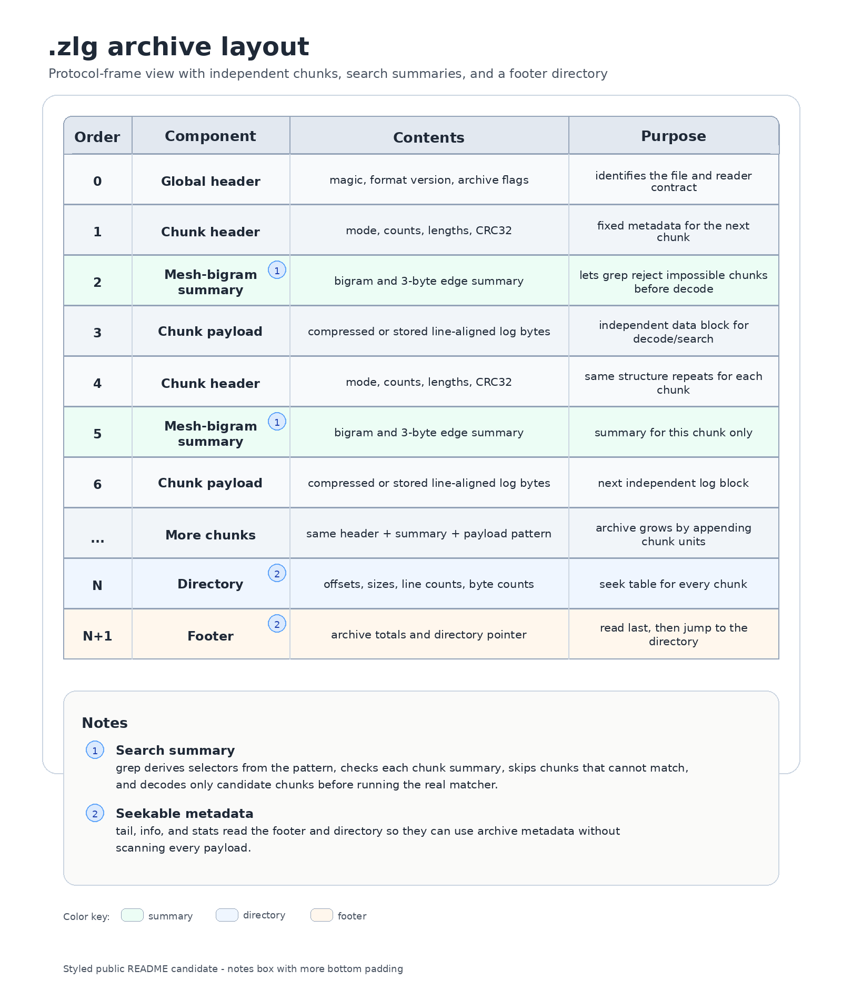

# zlg file format overview

`.zlg` is a line-oriented compressed log archive format. The on-disk format is versioned and frozen at format version 1.

A `.zlg` file contains:

1. a global header;
2. repeated chunks;
3. a seekable directory;
4. a footer.

## Chunks

Each chunk is independent. A chunk contains:

- a chunk header;
- a mesh-bigram search summary;
- a compressed or stored payload.

zlg groups input by lines until a target line count or byte cap is reached. This gives zstd enough data to compress effectively while keeping each decode unit bounded.

The chunk header stores line counts, byte counts, compression mode information, and a CRC over the uncompressed chunk bytes.

## Mesh-bigram summaries

The mesh-bigram summary is a compact per-chunk search filter. It is designed to reject impossible chunks before zlg spends time decoding their payloads.

A bigram is a pair of adjacent bytes. The text `status` contains `st`, `ta`, `at`, `tu`, and `us`. A mesh edge connects adjacent bigrams by storing the overlapping 3-byte window: `sta`, `tat`, `atu`, and `tus`. Each edge preserves more order information than a loose set of independent bigrams.

When zlg writes a chunk, it scans the uncompressed chunk and records the sorted, deduplicated set of these 3-byte edges. The summary is stored next to the chunk payload, so it can be read before the payload is decoded.

When zlg searches, the planner derives literal selectors from the pattern:

- fixed-string search uses the fixed string as the selector;
- simple regex patterns use literal runs or one literal per top-level branch where possible;
- selected PCRE2 positive-lookbehind patterns can use the lookbehind prefix as a selector.

The planner converts those selectors into the same 3-byte edge representation and checks each chunk summary. If a required selector edge is missing, the chunk cannot contain the selector and zlg skips the payload. If all required edges are present, the chunk is a candidate and is decoded and matched normally.

The summary is not final proof. It is a fast reject filter. False positives are allowed; false negatives are not. The real matcher still decides whether a line matches.

The mesh summary is chunk-level. It helps choose which chunks to decode, not which exact line to start on inside a chunk. Seekable commands such as `tail`, `info`, and `stats` use the directory's line counts and byte counts, while search scans candidate chunks line by line.

## Directory and footer

The footer points to the directory. The directory records chunk offsets, lengths, line counts, and byte counts.

This is what makes file-backed commands efficient:

- `zlg tail` can seek near the end of the archive;
- `zlg info` can report layout metadata without a full decode;
- `zlg stats` can calculate component sizes quickly.

## Checksums

zlg stores a CRC over uncompressed chunk bytes. That means the integrity check is over the data users actually see after decompression.

Default grep output remains streaming for low latency. `zlg grep --strict` verifies each candidate chunk before emitting output from that chunk.
